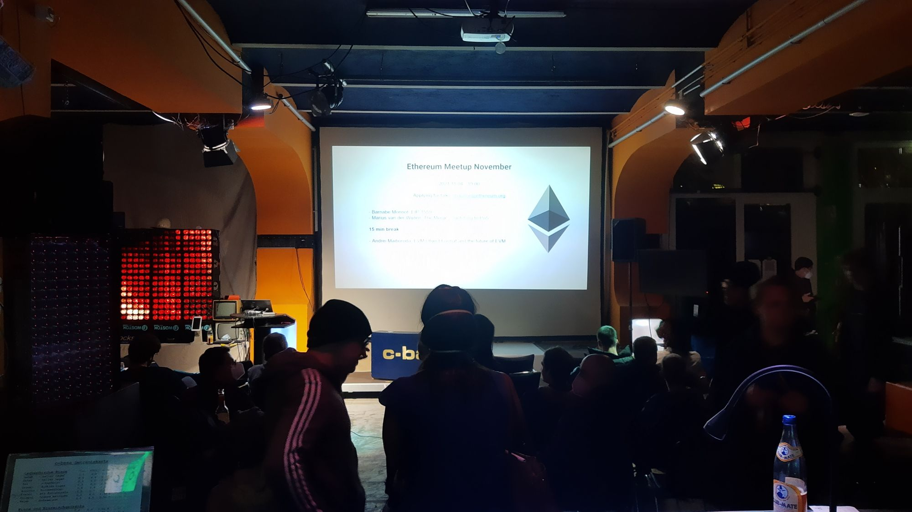

# Purpose

This repo is intended to coordinate Ethereum Berlin events

# Workflow

Talk proposals are added via issues (with the label `proposed talk`)
There is a milestone for each meetup and adding a `proposed talk` issue to this milestone means we want this talk at that meetup
We aim for 3-4 talks per meetup

# Timeline

 * init: select a concrete date for the next event
 * 2-3 weeks before the event:
   * contact presenters on shortlist (see all issues of the milestone for the event)
   * organize camera & define camer-operator
   * define moderator
   * (only in pandemic times): make hygiene concept for event and define humans responsible entrance (ideally 2 teaams a 2 people)
 * 1 week pew event: 
   * finalize and confirm with speakers and ask them how they want to present (laptop or adapters needed?)
   * announce on twitter/meetup
 * 1 day before the event:
   * tweet & meetup email with reminder and agenda
 * at the event
   * make sure audio is recorded at the source
   * (only in pandemic times): burn data envelope
 * 1day..1week after the event
   * publish videos
 
# Resources

 * https://twitter.com/berlinmeetup
 * https://www.meetup.com/de-DE/Berlin-Ethereum-Meetup/

# Visual

